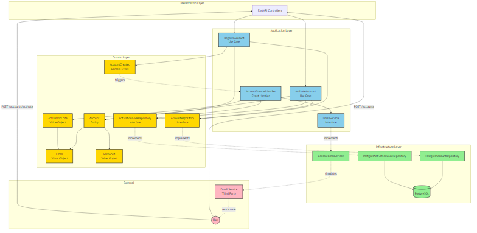

# User Registration API

Technical test implementation for account registration with email verification.

## Table of Contents
- [Overview](#overview)
- [Architecture](#architecture)
- [Technical Stack](#technical-stack)
- [Domain Design](#domain-design)
- [API Endpoints](#api-endpoints)
- [Getting Started](#getting-started)
- [Testing](#testing)

## Overview

REST API for user registration with email-based account activation using a time-limited 4-digit verification code.

### Features
- User account creation with email and password
- Automatic verification code generation (4 digits)
- Email delivery of activation code
- Time-limited code validation (60 seconds)
- Account activation with Basic Authentication

## Architecture

### Clean Architecture & DDD

This project follows Clean Architecture principles with Domain-Driven Design tactical patterns.

<!-- Architecture diagram will be here -->


### Bounded Context: Account

The application is built around a single bounded context: **Account**.

#### Layer Structure

```
src/
├── account/                          # Bounded Context: Account
│   ├── domain/                       # Domain Layer (Business Logic)
│   │   ├── entities/
│   │   │   └── account.py           # Aggregate Root
│   │   ├── value_objects/
│   │   │   ├── email.py
│   │   │   ├── password.py
│   │   │   └── activation_code.py
│   │   ├── events/
│   │   │   └── account_created.py
│   │   ├── repositories/            # Repository Interfaces
│   │   │   ├── account_repository.py
│   │   │   └── activation_code_repository.py
│   │   └── exceptions/
│   │       └── domain_exceptions.py
│   ├── application/                  # Application Layer (Use Cases)
│   │   ├── contracts/               # External Service Interfaces
│   │   │   └── services/
│   │   │       └── email_service.py
│   │   ├── use_cases/
│   │   │   ├── register_account.py
│   │   │   └── activate_account.py
│   │   └── dto/
│   │       └── account_dto.py
│   └── infrastructure/              # Infrastructure Layer (Technical Details)
│       ├── persistence/
│       │   ├── postgres_account_repository.py
│       │   └── postgres_activation_code_repository.py
│       ├── email/
│       │   └── console_email_service.py
│       └── http/
│           └── account_controller.py
└── main.py                          # FastAPI Application Entry Point
```

### Key Design Decisions

#### 1. Separate Repository for Activation Codes

Two distinct repositories with clear responsibilities:
- **`AccountRepository`**: Manages account lifecycle (creation, retrieval, activation status)
- **`ActivationCodeRepository`**: Manages short-lived verification codes (creation, validation, deletion)

**Rationale:**
- Single Responsibility Principle compliance
- Independent testing with dedicated mocks
- Future evolution without coupling (e.g., code history, retry mechanisms)

#### 2. Asynchronous Code Generation

**Flow:**
1. `POST /accounts` creates account (synchronous)
2. `AccountCreated` event emitted
3. Event handler generates code and sends email (asynchronous)

**Rationale:**
- Code generated just before email sending minimizes time window loss
- Handles message broker latency gracefully
- User gets maximum 60 seconds regardless of queue delays

#### 3. Immutable Entities

**Pattern:**
```python
# Entity methods return new instances
activated_account = account.activate(code)
repository.save(activated_account)
```

**Rationale:**
- No Active Record anti-pattern
- Pure domain logic without infrastructure coupling
- Thread-safe operations

#### 4. No ORM - Raw SQL

Direct SQL queries using psycopg2 without Object-Relational Mapping.

**Rationale:**
- Explicit control over database operations
- Performance transparency
- No "magic" abstractions
- Demonstrates raw SQL proficiency

## Technical Stack

### Core Technologies
- **Python**: 3.13
- **Dependency Management**: Poetry 1.8.4
- **Web Framework**: FastAPI (routing, dependency injection)
- **Database**: PostgreSQL 16
- **Database Driver**: psycopg2 (raw SQL, no ORM)
- **Testing**: pytest, pytest-asyncio, pytest-cov, httpx
- **Code Quality**: black, ruff, mypy
- **Containerization**: Docker, Docker Compose

### Third-Party Services
- **Email Service**: Console output (production-ready abstraction for SMTP/HTTP API)

## Domain Design

### Aggregate Root
- **`Account`**: Core entity managing user registration and activation state

### Value Objects
- **`Email`**: Email address with validation
- **`Password`**: Hashed password with strength requirements
- **`ActivationCode`**: 4-digit code with expiration timestamp (60 seconds)

### Domain Events
- **`AccountCreated`**: Triggered after successful account persistence

### Repositories (Domain Interfaces)

#### AccountRepository
```python
def save(account: Account) -> None
def find_by_id(account_id: UUID) -> Optional[Account]
def find_by_email(email: Email) -> Optional[Account]
def mark_as_verified(account_id: UUID) -> None
```

#### ActivationCodeRepository
```python
def save(account_id: UUID, code: ActivationCode) -> None
def find_by_account_id(account_id: UUID) -> Optional[ActivationCode]
```

### Use Cases

#### RegisterAccount
- Creates account with email and password
- Persists account in database
- Emits `AccountCreated` event

#### ActivateAccount
- Validates Basic Auth credentials
- Verifies activation code and expiration
- Marks account as verified

## API Endpoints

### `POST /accounts`

Create a new user account and trigger verification email.

**Request:**
```json
{
  "email": "user@example.com",
  "password": "SecureP@ssw0rd"
}
```

**Response:** `201 Created` No content

**Error Responses:**
- `400 Bad Request`: Invalid email format or weak password
- `409 Conflict`: Email already registered

---

### `POST /accounts/activate`

Activate account using 4-digit verification code.

**Authentication:** Basic Auth (email:password)

**Request:**
```json
{
  "code": "1234"
}
```

**Response:** `200 OK`
```json
{
  "message": "Account successfully activated"
}
```

**Error Responses:**
- `401 Unauthorized`: Invalid credentials
- `400 Bad Request`: Invalid or expired code
- `404 Not Found`: No pending activation code

## Database Schema

### `account` table
```sql
CREATE TABLE account (
  id UUID PRIMARY KEY,
  email VARCHAR(255) UNIQUE NOT NULL,
  password_hash VARCHAR(255) NOT NULL,
  is_verified BOOLEAN DEFAULT FALSE NOT NULL,
  created_at TIMESTAMP DEFAULT NOW() NOT NULL
);
```

### `account_activation_code` table
```sql
CREATE TABLE account_activation_code (
  id UUID PRIMARY KEY,
  account_id UUID NOT NULL REFERENCES account(id) ON DELETE CASCADE,
  code CHAR(4) NOT NULL,
  expires_at TIMESTAMP NOT NULL,
  created_at TIMESTAMP DEFAULT NOW() NOT NULL,
  CONSTRAINT unique_active_code_per_account UNIQUE(account_id)
);
```

## Getting Started

### Prerequisites
- Docker
- Docker Compose

### Environment Configuration

The project uses environment variables for configuration. Default values are provided for development.

```bash
# (Optional) Copy environment template and customize
cp .env.example .env

# Edit .env if you want to change database credentials
# nano .env
```

**Note:** The application works out-of-the-box with default values. Creating `.env` is optional.

### Running the Application

```bash
# Start all services
docker-compose up -d

# Check application health
curl http://localhost:8000/health

# View logs
docker-compose logs -f api
```

The API will be available at `http://localhost:8000`.

### Running Tests

```bash
# Run all tests
docker-compose run --rm api pytest

# Run unit tests only
docker-compose run --rm api pytest tests/unit

# Run integration tests only
docker-compose run --rm api pytest tests/integration

# Run with coverage
docker-compose run --rm api pytest --cov=src --cov-report=html
```

## Testing Strategy

### Unit Tests
- Domain entities and value objects (pure logic)
- Use cases (mocked repositories and services)
- Validators and business rules

### Integration Tests
- API endpoints (full HTTP stack)
- Database operations (real PostgreSQL instance)
- Event handlers (complete flow)

### Test Structure
```
tests/
├── unit/
│   ├── domain/
│   ├── application/
│   └── infrastructure/
└── integration/
    ├── api/
    └── persistence/
```

## Development Workflow

### Dependency Management

This project uses **Poetry** for dependency management (like Composer for PHP or npm for Node.js).

```bash
# Install dependencies inside container
docker-compose run --rm api poetry install

# Add a new dependency
docker-compose run --rm api poetry add <package>

# Add a dev dependency
docker-compose run --rm api poetry add --group dev <package>

# Update dependencies
docker-compose run --rm api poetry update
```

### Code Quality Tools

All tools are configured in `pyproject.toml`.

```bash
# Format code
docker-compose run --rm api poetry run black src tests

# Lint code
docker-compose run --rm api poetry run ruff check src tests

# Type checking
docker-compose run --rm api poetry run mypy src
```

## License

This is a technical test implementation for educational purposes.